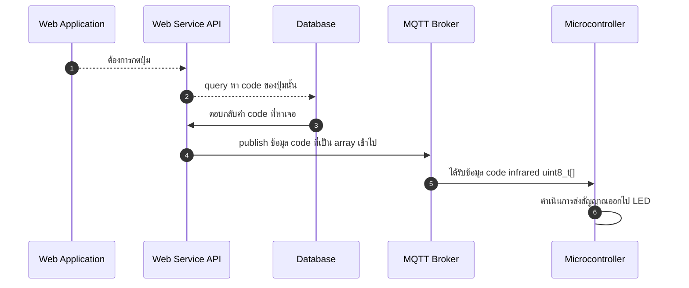

# huberlink-platform

HuberLink Platform IoT

## MQTT Topic

`huberlink/%s/thing/execute` to execute command

`huberlink/%s/thing/heartbeat` to check latest state

`huberlink/%s/thing/report` to save data which come from thing

